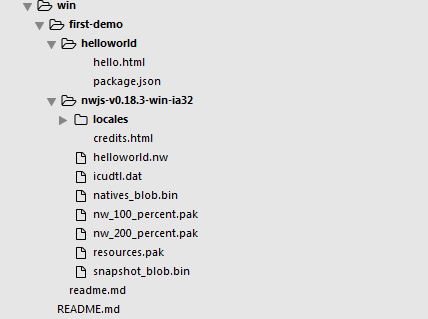

## 目录结构

## 打包

1. 将项目中所有文件压缩打包为.zip格式文件并修改后缀名为.nw
	
	例： 将helloworld文件夹中的文件合并打包并修改后缀名

2. 将打包生成的.nw拖动到nw.exe文件上运行

3. 执行命令 copy /b nw.exe+目标文件.nw app.exe
	
	例： copy /b nw.exe+helloworld.nw app.exe

